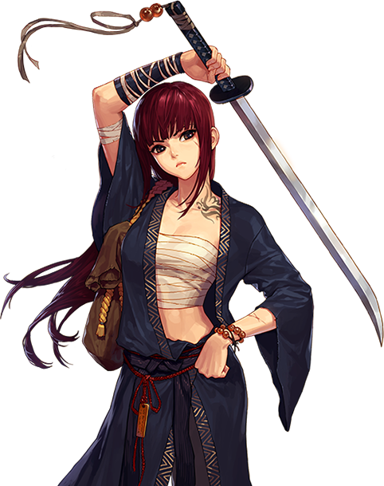

# Kiru.js

<p align="center">
  
</p>

The Kiru.js Project. `(c) scraper`

A serverless RESTful API scraper that scrapes data from selected manga sites created using puppeteer and Node.js

**Link to API**: https://kiru-js.vercel.app/

## Features

✅ Scrape new updates from your favorite manga series.

✅ Uses chrome-aws-lambda to scrape headless.

✅ Really easy to use.

✅ Up to date.

## Current available sources:

✅ **MangaKatana** [OK]

✅ **Manganelo** [OK]

## What data is being scraped?

- Source
- Title
- Cover Image
- Status
- Latest Chapter
- Latest Chapter Link
- Description

## Installation/Development

1. Clone the project <br>
   `git clone https://github.com/re-nanashi/kiru.git`

2. Go the directory and run npm install

```
npm install
```

3. Setup Vercel CLI then run

```
vercel dev
```

## Update:

- Currently, kiru.js direct is recommend when run on the deployed web address. Unfortunately at this moment, kiru.js main or full scraping through queries/keyword is only recommended when used in development. I will update as soon as possible.

## Basic Example Usage

### Kiru.js direct

`run https://kiru-js.vercel.app/direct?url=`

**Sample scrape using direct endpoint:**

```
https://kiru-js.vercel.app/direct?url=http://mangakatana.com/manga/legend-of-the-northern-blade.24729
```

**Sample output for the above url:**

```
"{\"mangakatana\":{\"link\":\"https://mangakatana.com/manga/legend-of-the-northern-blade.24729\",\"title\":\"Legend of the Northern Blade\",\"image\":\"https://i3.mangakatana.com/token/05d248492010285612g5x9556fp5rq5gt23rc_5na821psziwy%3Ar4n%2Ag%3A3o%2Ab-.e_4g3r87.%3A9f2y599vv_n-vu%3Anp.p9c0p/legend-of-the-northern-blade.jpg\",\"status\":\"Ongoing\",\"latest\":\"Chapter 87\",\"latestLink\":\"https://mangakatana.com/manga/legend-of-the-northern-blade.24729/c87\",\"description\":\"When the world was plunged into darkness martial artists gathered to form the ‘Northern Heavenly Sect’. With the help of the Northern Heavenly Sect people began to enjoy peace again. However, as time passed the martial artists began to conspire against the ‘Northern Heavenly Sect’, and eventually caused the death of the Sect Leader, Jin Kwan-Ho, destroying the sect with it. As everyone left the sect, Jin Kwan-Ho’s only son, Jin Mu-Won was left behind. Mu-Won has never learned martial arts, but he finds the Techniques secretly left behind by his father and begins to acquire the martial arts of the Northern Heavenly Sect.\"}}"
```

**Sample fetch request**

```js
let response = (
	await fetch(
		`https://kiru-js.vercel.app/direct?url=${url}`,
		{ method: 'GET' },
		{ mode: 'no-cors' }
	)
).json();

let data = await res;

return JSON.parse(data);
```

### Kiru.js Main

`run http://localhost:8888/manga?source={source1-source2}&keyword={series title}` [OK]

`run https://kiru-js.vercel.app/manga?source={source1-source2}&keyword={series title}` [NR]

**npm start**

```
npm run start
```

**Sample scrape using main/manga endpoint:**

```
http://localhost:8888/manga?source=mangakatana-manganelo&keyword=legend of the northern blade
```

### Things that I learned:

- Learned some concepts about the backend.
- Learned some concepts about APIs.

### TODO

- Refactor in the future for a more simpler and understandable structure.
- Add more sources.
- Add database.

## Acknowledgments

Design inspiration, icons, cover, etc.

- [Cover Photo](https://imgur.com/r/DFO/chAqw)

## Note

**This service was created for personal use. It is not meant to be for commercial or business purposes.**

## Author

John Reymar I. Fabro(Me)
[@juanfab.af](https://www.instagram.com/juanfab.af/)
